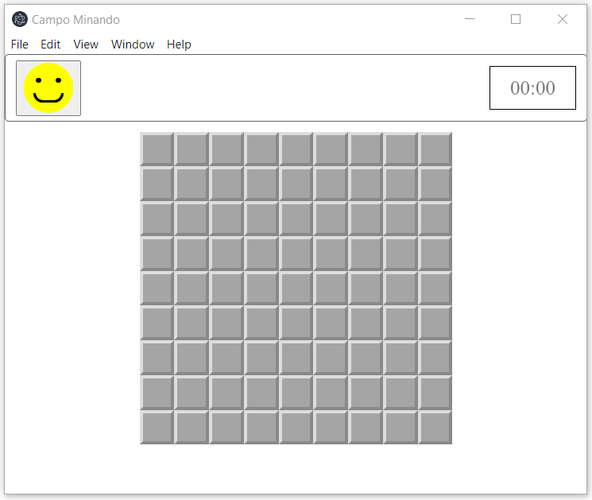
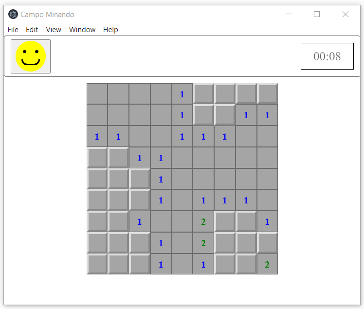
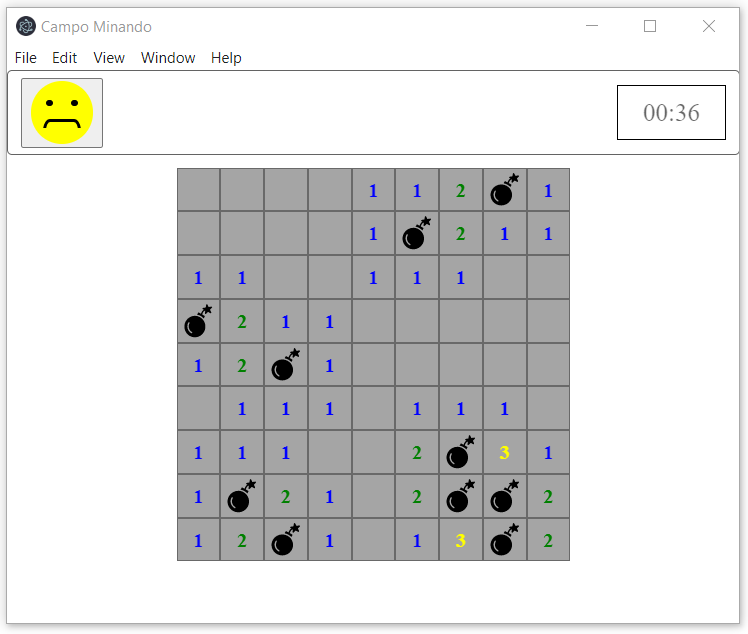

<h1 align="center">:video_game: Campo minado :bomb:</h1>
<p align="center">Jogo de campo minado construído com Electron js</p>

<p align="center">
  <a href="#como-instalar">Como Instalar</a> •
  <a href="#licença">Licença</a> •
</p>

<p align="center">
  
  

  
  
  
</p>

### Como instalar
Primeiro baixe o repositório para o seu computador, como mostra abaixo:
```bash
  git clone https://github.com/rogeriomattos/campo-minado/
```

Então, entre na pasta ``campo-minado`` e instale as dependências do projeto, como mostra abaixo:
```bash
  cd campo-minado
  npm istall
```

Por último, para executar o jogo basta rodar o seguinte comando:
```bash
  npm start
```

### Licença
Este projeto pode ser usado por qualquer pessoa! Licença MIT

